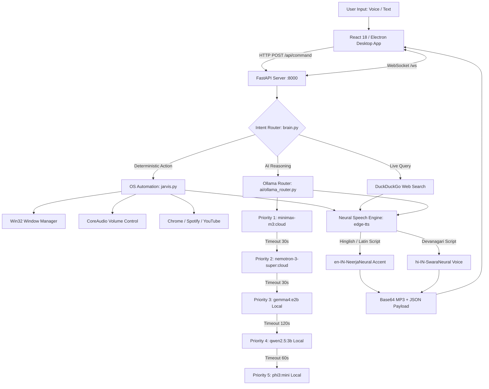

# JARVIS — Open-Source Full-Stack AI Desktop Assistant 🤖⚡

[](https://python.org)
[](https://fastapi.tiangolo.com)
[](https://reactjs.org)
[](https://electronjs.org)
[](https://tailwindcss.com)
[](https://ollama.ai)
[](https://opensource.org/licenses/MIT)

JARVIS is an open-source **Full-Stack Desktop AI Assistant** built for Windows. It integrates an Electron desktop shell, a React 18 frontend dashboard, an asynchronous FastAPI backend microservice, real-time WebSocket log streaming, a 5-model Ollama AI priority router, Microsoft Edge Neural Speech Synthesis, and native Windows OS automation.

---

## 📌 Architectural Overview

JARVIS is designed as a local-first desktop application with a decoupled frontend/backend architecture. User interactions (text or voice) flow through a multi-stage intent pipeline that routes queries either to deterministic Windows automation routines or to an Ollama-backed AI reasoning engine.



---

## 🏗️ Engineering Architecture & Tech Stack

### 1. Desktop Shell Layer (`frontend jarvis/main.js`)
- **Technology**: Electron 30, Node.js IPC, Windows API
- **Responsibilities**: Manages frameless window rendering, custom title bar actions, native media permissions, and global hotkeys (`Ctrl+Alt+J`). Spawns `server.py` and `ollama` as detached background processes (`windowsHide: true`).

### 2. Frontend Dashboard Layer (`frontend jarvis/src/`)
- **Technology**: React 18, Vite 5, TailwindCSS, Framer Motion, Lucide Icons
- **Responsibilities**: Multi-thread chat drawer, HTML5 Audio player for base64 speech responses, animated HTML5 canvas visualizer, Web Speech API speech-to-text (`hi-IN`), and live terminal log display via WebSockets.

### 3. Backend Microservice Layer (`server.py`)
- **Technology**: Python 3.13, FastAPI, Uvicorn, Asyncio, WebSockets
- **Responsibilities**: REST API endpoint handling, asynchronous execution via `asyncio.to_thread`, custom `LogStream` stdout interception, and real-time log broadcasting over `/ws`.

### 4. Intent Classification & Routing (`brain.py`)
- **Technology**: Regex parsing, Hinglish translation rules, Ollama query router
- **Responsibilities**: Decouples fast OS commands (e.g., `volume up`, `chrome kholo`) from AI reasoning requests. Compound command handler splits chained requests (`then`, `phir`, `aur`, `and`) for sequential execution.

### 5. OS & Browser Automation Engine (`jarvis.py`)
- **Technology**: `pywin32`, `pycaw`, `nircmd`, `yt-dlp`
- **Responsibilities**: Native Win32 window state management (focus, minimize, maximize, restore, close), UWP app launching (`explorer.exe shell:AppsFolder\...`), CoreAudio volume adjustments, Spotify Web tab interaction, YouTube video searching, and Desktop file operations.

### 6. Neural Speech Pipeline (`server.py` & `edge-tts`)
- **Technology**: `edge-tts`, `gTTS` fallback
- **Responsibilities**: Converts response text into base64-encoded MP3 streams. Uses `en-IN-NeerjaNeural` (Indian English Female accent) for Latin Hinglish text and `hi-IN-SwaraNeural` for Devanagari Hindi text.

---

## ⚡ Feature Implementation Matrix

| Feature | Capability | Technical Implementation | Status |
|---|---|---|---|
| **Window Automation** | Open, close, minimize, maximize, restore, focus any app | Win32 API (`pywin32`) + UWP App Shell launcher. Maintains last active window context. | ✅ Implemented |
| **Volume Control** | Set volume %, mute, unmute, increase/decrease | Windows CoreAudio API (`pycaw`) with fallback to `nircmd.exe`. | ✅ Implemented |
| **Hinglish Command Parser** | `chrome kholo`, `awaaz badhaao`, `gaana bajao` | Preprocessing translation rules + Ollama fallback routing. | ✅ Implemented |
| **Neural TTS** | Natural Indian Female voice output | `edge-tts` base64 streaming (`en-IN-NeerjaNeural` & `hi-IN-SwaraNeural`). | ✅ Implemented |
| **Speech Recognition** | Voice input in Hinglish / Hindi | Web Speech API configured to `hi-IN` locale in React frontend. | ✅ Implemented |
| **YouTube Automation** | Search and play videos by index | `yt-dlp` metadata extraction + Chrome automation. | ✅ Implemented |
| **Spotify Automation** | Play tracks, pause, next on Spotify Web | Automated Chrome web navigation targeting Spotify Web player tab. | ✅ Implemented |
| **AI Reasoning** | General Q&A, code writing, math, technical queries | 5-model Ollama priority fallback gateway (`ai/ollama_router.py`). | ✅ Implemented |
| **Live Web Search** | Weather, news, real-time factual lookups | DuckDuckGo search API (`ddgs`) with LLM summarization. | ✅ Implemented |
| **File Generation** | `create file sort.py and write code` | Direct disk IO with regex markdown code block stripping, saving to Desktop. | ✅ Implemented |
| **Memory Management** | Remember user facts, recall history | JSON storage (`memory/memory_manager.py`) with 1GB automated log pruning. | ✅ Implemented |
| **Global Hotkey** | Toggle/focus app from anywhere (`Ctrl+Alt+J`) | Electron `globalShortcut` native Windows API bindings. | ✅ Implemented |

---

## 💾 Persistence Architecture

JARVIS utilizes a hybrid persistence model:

1. **Client State (LocalStorage)**: Chat thread history (`jarvis-threads`), active thread selections, and custom system prompt overrides are stored directly in the user's browser LocalStorage.
2. **Server State (JSON Storage Engine)**: Backend context, daily activity logs, last active application tracking, and long-term key-value memories are managed by `memory/memory_manager.py` using structured JSON files (`history.json`, `daily_log.json`, `last_app.json`, `app_history.json`).
3. **Legacy Artifact Note**: The repository contains an early Node.js/Express stub (`frontend jarvis/backend/server.js` and `db.js`). This stub is **unused** in the primary application lifecycle; the active production backend is `server.py` (FastAPI).

---

## 🔒 Security & Local Networking Model

- **Local Application Scope**: JARVIS is built as a single-user local desktop application.
- **CORS Configuration**: `server.py` configures `allow_origins=["*"]` to allow seamless local cross-origin communication between the Electron desktop shell (`file://` or Vite dev server `http://localhost:5173`) and the FastAPI backend (`http://localhost:8000`).
- **Network Boundaries**: The backend API does not implement remote authentication/OAuth. It is intended strictly for local execution (`127.0.0.1`).

---

## 📡 API Reference

### 1. Execute Command / Conversation
`POST /api/command`

**Request Body:**
```json
{
  "input": "chrome kholo then set volume 40",
  "system_prompt": "Optional custom system prompt"
}
```

**Response Payload:**
```json
{
  "message": "Opening Chrome for you right now, sir!",
  "type": "command",
  "action": "open",
  "target": "chrome",
  "model_used": "Ollama",
  "success": true,
  "timestamp": "2026-08-12T14:30:00.000000",
  "audio": "data:audio/mp3;base64,SUQzBAAAAAAA..."
}
```

### 2. Text-to-Speech Endpoint
`POST /api/tts`

**Request Body:**
```json
{
  "text": "Arre, kya hua Samarth?"
}
```

**Response Payload:**
```json
{
  "audio": "data:audio/mp3;base64,SUQzBAAAAAAA..."
}
```

### 3. System Prompt Management
- `GET /api/system-prompt`: Returns `{ "system_prompt": "..." }`
- `POST /api/system-prompt`: Updates active prompt, returns `{ "status": "ok", "system_prompt": "..." }`

### 4. Service Health Check
`GET /api/health`
- Returns `{ "status": "ok", "service": "JARVIS", "time": "..." }`

### 5. Real-Time Log Stream
`GET /ws`
- WebSocket connection streaming live stdout log strings to connected frontend clients.

---

## 📂 Project Structure

```
JARVIS/
├── ai/
│   └── ollama_router.py       # 5-model priority chain & Ollama adapter
├── memory/
│   ├── memory_manager.py      # JSON persistence & 1GB log auto-pruner
│   ├── history.json           # Conversation context
│   └── daily_log.json         # Activity log
├── frontend jarvis/
│   ├── main.js                # Electron main process (IPC, hotkeys, spawner)
│   ├── package.json           # Frontend dependencies & Electron build config
│   ├── dist/                  # Production Vite build output
│   └── src/
│       ├── App.jsx            # React root component
│       └── components/
│           ├── AppShell.jsx   # Window layout wrapper & hotkey events
│           ├── TitleBar.jsx   # Custom frameless title bar
│           ├── CommandBar/    # Voice STT, input, and base64 audio player
│           ├── Main/          # Canvas visualizer & suggestion cards
│           └── Sidebar/       # Thread history drawer & navigation
├── brain.py                    # Intent classifier, Hinglish parser & router
├── jarvis.py                   # Core Win32 OS automation engine
├── server.py                   # FastAPI server, WebSockets & Edge-TTS engine
├── wake_jarvis.py              # Hotkey daemon & wake listener
├── requirements.txt            # Python dependencies
└── README.md                   # System documentation
```

---

## ⚙️ Installation & Execution

### Prerequisites
- **Operating System**: Windows 10 / Windows 11 (64-bit)
- **Python**: 3.13 or higher
- **Node.js**: 18.0 or higher
- **Ollama**: Installed from [ollama.ai](https://ollama.ai)

---

### Step 1 — Clone Repository
```bash
git clone https://github.com/samarth-maheshwari-dev/Personal-Ai-ASISTANT.git
cd Personal-Ai-ASISTANT
```

### Step 2 — Environment & Dependencies
```bash
# Create and activate Python virtual environment
python -m venv .venv
.venv\Scripts\Activate.ps1

# Install Python backend dependencies
pip install -r requirements.txt
```

### Step 3 — Pull Local Ollama Models
Ensure Ollama is running, then pull local models for offline execution:
```bash
ollama pull qwen2.5:3b
ollama pull phi3:mini
```

### Step 4 — Run Application

#### Desktop App Mode (Electron Shell)
```bash
# Terminal 1: Start Backend Server
python server.py

# Terminal 2: Launch Desktop App
cd "frontend jarvis"
npm install
npm run electron .
```

#### Browser Development Mode
```bash
# Terminal 1: Start Backend Server
python server.py

# Terminal 2: Start Vite Dev Server
cd "frontend jarvis"
npm run dev
# Open http://localhost:5173 in Chrome
```

---

## ⚠️ Known Limitations

1. **Windows OS Dependency**: Win32 window handles (`pywin32`) and CoreAudio controls (`pycaw`) require Microsoft Windows.
2. **Chrome Path Requirement**: Browser automation assumes Google Chrome is installed in standard Windows system paths.
3. **Local Hardware Constraints**: Local LLM execution via Ollama requires sufficient system RAM/VRAM (8GB+ recommended).

---

## 🚧 Development Roadmap

- [x] **Phase 1**: Core Win32 Automation Engine, Electron + React UI, Ollama Router, Indian Female Neural TTS.
- [ ] **Phase 2 — Mobile Web Remote**: Mobile PWA connecting via WebSockets to control desktop actions remotely.
- [ ] **Phase 3 — Social Messaging Automation**: WhatsApp and Instagram messaging integration via Playwright contexts.
- [ ] **Phase 4 — Local Document RAG**: Local PDF parsing and vector embeddings for semantic document search.

---

## 📜 License

Distributed under the [MIT License](LICENSE).

**Author**: Samarth Maheshwari  
*Full-Stack Engineer & AI Automation Builder — Indore, India 🇮🇳*  
- GitHub: [@samarth-maheshwari-dev](https://github.com/samarth-maheshwari-dev)
